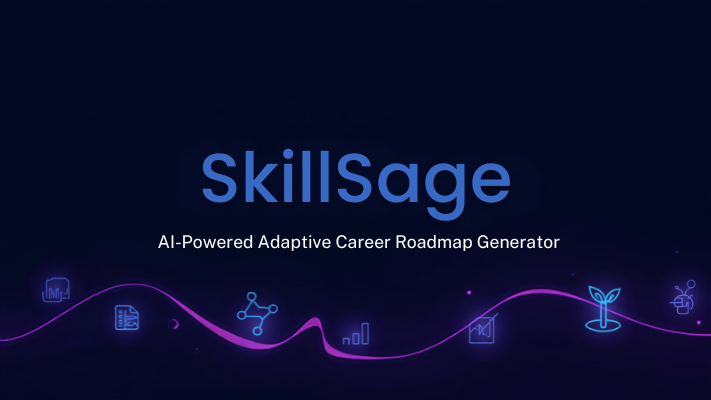
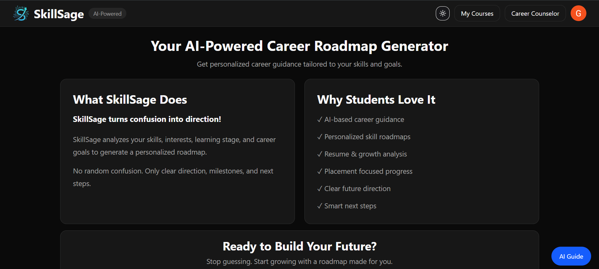
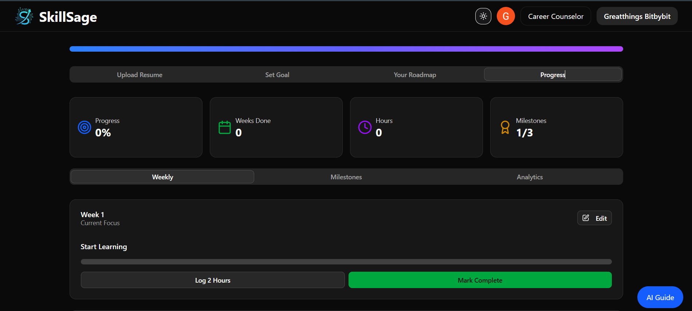
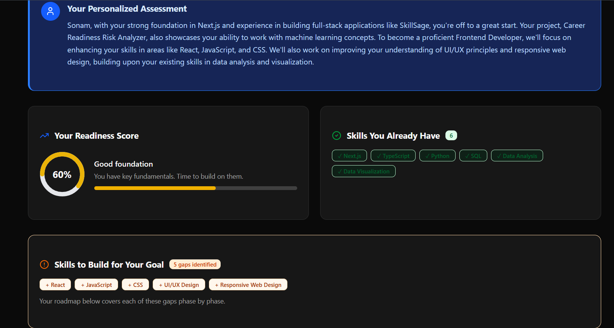
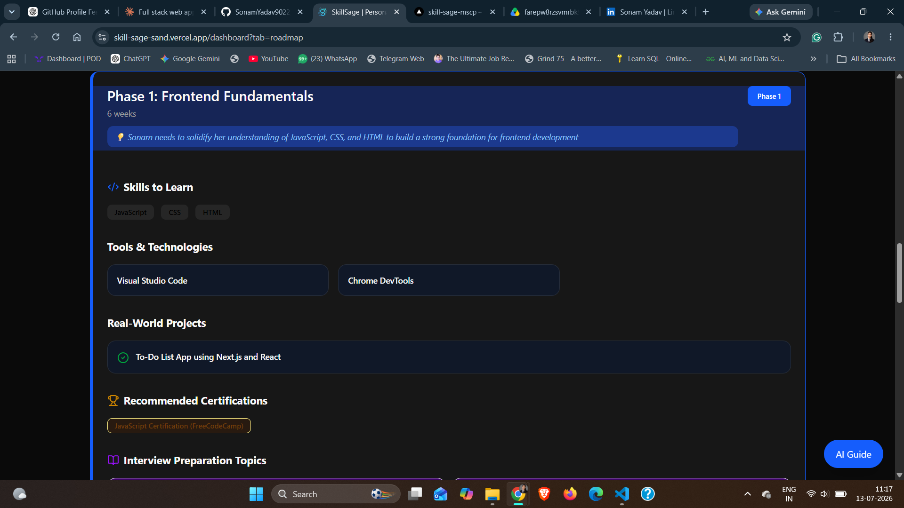
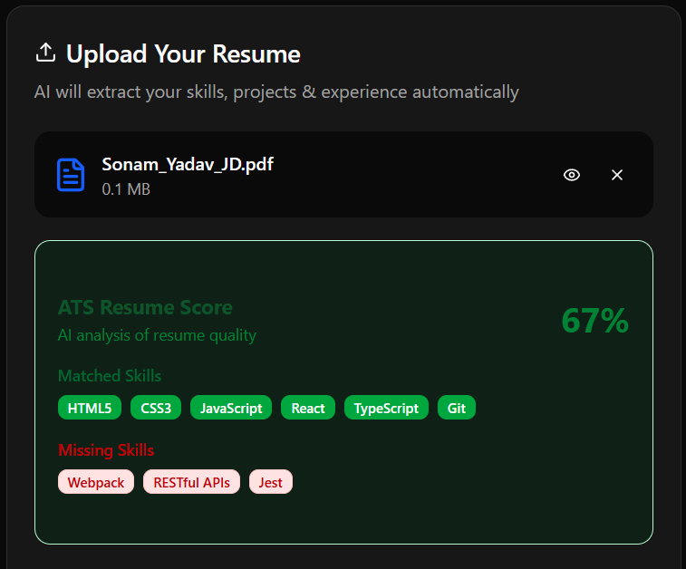
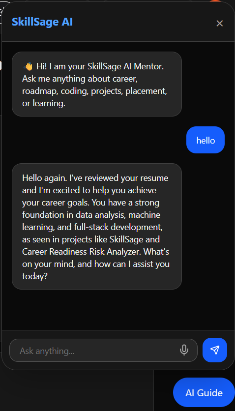

# 🚀 SkillSage – AI-Powered Adaptive Career Roadmap Generator

<p align="center">
  
</p>

<p align="center">


</p>

---

## 🌐 Live Demo

🔗 **Live Website:** https://skill-sage-sand.vercel.app/

## 💻 GitHub Repository

🔗 https://github.com/SonamYadav9022/SkillSage

---

# 📖 About SkillSage

SkillSage is an AI-powered career guidance platform that analyzes resumes, evaluates ATS compatibility, identifies skill gaps, and generates personalized learning roadmaps to help students and professionals achieve their career goals.

The platform leverages Large Language Models (Groq AI) to provide intelligent recommendations, career guidance, and resume analysis while delivering a modern and responsive user experience.

Originally developed as a **Final Year Engineering Group Project**, SkillSage continues to evolve with ongoing improvements, deployment optimizations, AI enhancements, and production-ready features.

---

# 🎯 Problem Statement

Finding the right career path can be overwhelming.

Most students struggle with

- Resume quality
- ATS optimization
- Skill gap identification
- Choosing projects
- Selecting certifications
- Planning a learning roadmap

SkillSage solves these challenges using AI-driven analysis and personalized recommendations.

---

# ✨ Features

### 📄 Resume Analysis

- AI-powered resume parsing
- Resume insights
- PDF Upload
- Cloudinary integration

---

### 🎯 Dynamic ATS Score

- ATS compatibility score
- Career-goal-specific evaluation
- AI-generated improvement suggestions

---

### 🧠 Personalized Career Roadmap

- Goal-based roadmap generation
- Skill recommendations
- Milestone tracking

---

### 💬 AI Career Assistant

- AI-powered career chatbot
- Personalized career guidance
- Resume-based conversations

---

### 📚 Learning Recommendations

- Recommended Projects
- Certifications
- Online Courses
- Skill Development Path

---

### 🔐 Authentication

- Google OAuth
- Credentials Login
- Secure Authentication using NextAuth

---

### 📊 Dashboard

- User Profile
- Progress Tracking
- Learning Journey

---

# 🛠 Tech Stack

## Frontend

- Next.js 15
- React
- TypeScript
- Tailwind CSS

## Backend

- Next.js API Routes
- NextAuth

## Database

- PostgreSQL
- Prisma ORM

## AI

- Groq AI

## Cloud Storage

- Cloudinary

## Deployment

- Vercel

---

# 📂 Project Structure

```
SkillSage/

│── app/
│── components/
│── prisma/
│── public/
│── lib/
│── hooks/
│── types/
│── utils/
│── styles/
│── assets/
```

---

# ⚙️ Workflow

```
User

↓

Login

↓

Upload Resume

↓

Cloudinary Storage

↓

Groq AI Resume Analysis

↓

ATS Evaluation

↓

Skill Gap Analysis

↓

Career Roadmap Generation

↓

Dashboard
```

---

# 📸 Screenshots

## 🏠 Landing Page

<p align="center">

</p>

---

## 📊 Dashboard

<p align="center">

</p>

---

## 📄 Resume Analysis

<p align="center">

</p>

---

## 🎯 Career Roadmap

<p align="center">

</p>

---

## 📈 ATS Score Analysis

<p align="center">

</p>

---

## 🤖 AI Career Assistant

<p align="center">

</p>
---

# 🚀 Future Enhancements

- Mock Interview Module
- Resume Builder
- Company-wise Preparation Roadmaps
- Learning Progress Analytics
- Email Notifications
- Admin Dashboard
- Mobile Application

---

# 👥 Contributors

| Contributor | Role | Key Contributions |
|-------------|------|-------------------|
| **Sonam Yadav** | **Full Stack Developer • Backend & AI Integration** | Project architecture, Backend development, AI integration (Groq), Authentication (NextAuth & Google OAuth), PostgreSQL & Prisma integration, ATS score improvement, Career roadmap generation, Deployment on Vercel, Core feature development & ongoing maintenance |
| **Chetana Ingle** | **Full Stack Developer • UI/UX, Backend & Feature Development** | ATS score enhancements, Resume upload & preview improvements, Cloudinary integration, AI chatbot refinements, UI/UX improvements, Bug fixes & feature enhancements |
| **Sakshi Nimsadkar** | **Full Stack Developer • Development Support & Testing** | Initial project setup, dark mode implementation, Repository management, Merge conflict resolution, Testing & development support |

---

# ✍️ Authors

This project was developed as a **Final Year Engineering Group Project** by:

- **Sonam Yadav**
- **Chetana Ingle**
- **Sakshi Nimsadkar**

---

# 📬 Contact

### Sonam Yadav

📧 sonamyadav246810@gmail.com

💼 LinkedIn: www.linkedin.com/in/sonamyadav9022

🌐 GitHub: https://github.com/SonamYadav9022

---
